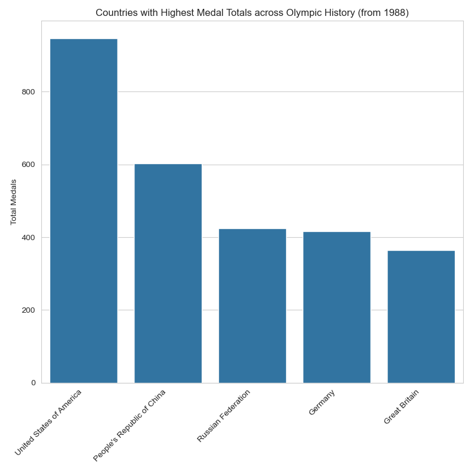
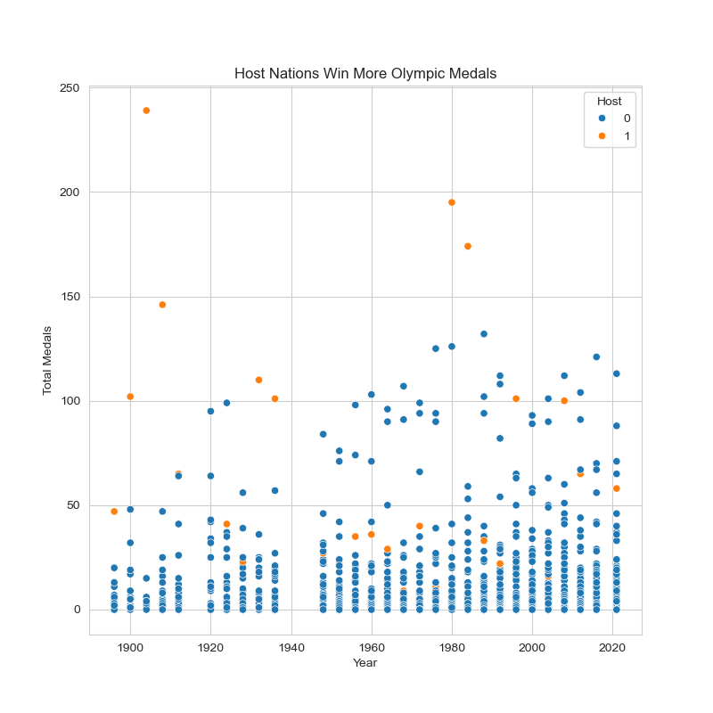
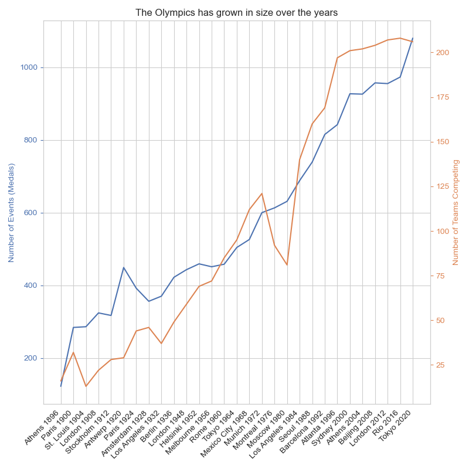

# Predicting Olympic Medals with Machine Learning


## Project Overview
Is it possible to predict the medals table for an Olympic Games using machine learning? Can this be done using only publically-available information? This project uses traditional ML to train a model on historical Olympic data retrieved from the web, with a focus on XGBoost. This focused on summer Olypmic Games but some data was collected on Winter Games too.

## Motivation & Problem Statement
- A key motivation for this project was learning classic ML (e.g. scikit-learn), with a deeper dive into XGBoost specifically.
- A personal interest in sport and the Olympics let to the question of whether structured data could be gathered and used to train a ML model for future predictions.
- This would also hopefully generate insights into what the most important macro-features that drove predictions were.
- Some hypotheses included:
    - Larger populations have a bigger talent pool to draw from
    - Richer countries can afford to spend more on performance programmes
    - There are certain advantages for competing in a home Games, such as increased qualification spots, familiarity with venues, and home-crowd support
- This was developed around 2021 Tokyo Games and revisted ahead of Paris 2024.

## Data Collection & Processing
As ever this was not trivial as hoped. Everything online at the time wasn't clean or at the correct level of detail, complete, or clean enough for simple joins to other datasets.

### Data spec
> _For every Olympic Games, for every country at each Olympic Games, how many medals were won (total, gold, silver, bronze). Include data on population, GDP per Capita, and derive other relevant features_

Note: GDP per capita was used to avoid colinearity with population from using pure GDP

### Data Collection
1. Get medals data, e.g. [olympics.com medal results](https://www.olympics.com/en/olympic-games/london-2012/medals).
    - This was only medals >0. Countries with zero medals were also required.
2. Get all participant countries represented at each Games from [Wikipedia](https://en.wikipedia.org/wiki/List_of_participating_nations_at_the_Summer_Olympic_Games).
    - Note that the format of the key table here was a PAIN to extract then transform. Attendance as dots, countries changing names/merging etc--see below!

    

3. Join the medals table and the participation tables, along with some other cleaning (e.g. adding ISO alpha-3 codes for future joins, correct Tokyo2020 date to 2021 etc)

    

Code: [scrape_olympic_medals.ipynb](scrape_olympic_medals.ipynb)\
Data: [olympics_summer_results.csv](olympics_summer_results.csv)

### Feature Engineering
1. **Population:** Downloaded as [csv](maddison_population.csv). It's not immediately clear how long the lag between population size and results would be (e.g. if population explodes, how long before you start seeing the results rise?).
    - To account for this, multiple features were derived, applying different lags to the population data for a given Olympics (e.g. for 2012, population taken for 2012, 2008, 2004, 2000 etc)
2. **GDP Per Capita:** Downloaded as [csv](gdp-per-capita-maddison-2020.csv). Similar to population, features were generated to apply varied lags
    - i.e. how long does increased wealth take to flow into the performance system?
3. **Home Advantage:** Creating a binary flag for hosts of the Games to use as a feature. Does being a host at a recent Games carry advantage too?
4. **Medals per Team:** The number of events competed in and teams competing has changed over time, changing the 'medal scarcity'.
    - To account for this, a feature was derived to divide the total number of medals by the total number of teams.
5. **(optional) Historic Medals:** It is expected past performance would be a predictor of medal performance. This was engineered to be a feature.
    - _It could be argued this is a form of label-leak into the features_:
        - Train-test split will use a basic sampling strategy across all records
        - This means each country can have both train and test records over the years
        - If prior medal results are used, test data could leak into a training dataset (e.g. 2008 is a test year, 2012 is train, if the prior year's medals are a feature for 2012 then labels will leak).
    - While it's justified that this is known ahead of the Games, the predictions are arguably more interesting if they are all independent of any medal results.

Code: [olympics_feature_engineering.ipynb](olympics_feature_engineering.ipynb)\
Data: [olympics_summer_features.csv](olympics_summer_features.csv)

## Exploratory Data Analysis (EDA)
### Raw feature completeness
We require all features to be present for the modelling step, and a heatmap is a quick way to visualise gaps in the data. Where there are gaps these can be dropped prior to training.
- c.1.25% of country codes missing
- Missing population and GDP per capita data (source data not going far back enough or for all countries)
- This missing data impacts some features more than others (e.g. when deriving more historic data, 'older' features suffer the most)


### Medals per country
Some countries have dominated the Olympics historically. This is to be expected that the biggest and richest countries would dominate: the USA has been the main global superpower over the history of the Olympics, with Russia and China emerging from the 50s and 90s respectively.



### Indicative feature correlations
It is expected that there will be non-linear correlations in the dataset. However, the following correlation table shows that there is predictive signal in the data against key features.


### Population and GDP per capita increases medals
As hypothesised, it does seem that these features will provide predictive power.

This plot shows a sample of three countries, their respective population and GDP per capita growth, and the effect on medals. While the totals are not as smooth as the socioeconomic inputs, there is a clear pick-up in medals for all nations, most starkly China. The UK started more heavily investing in the Olympics around the turn of the century, which clearly paid dividends in medal totals.

Notice also the spikes in medals for China, the UK, and the US for years where they've hosted the Games. Theses indicate the home advantage (discussed more below), and was quite extreme for the early Olympics (possibly because international travel would have been so expensive in the early 1900s.)

Further to this, there were boycotts in Moscow 1980 and Los Angeles 1984 by the USA and USSR respectively. While USSR isn't plotted below, you can see that the USA had an especially large medals-windfall for the era. 


### The home advantage: hosts win more
Host nations win more medals. This makes sense, as it's very expensive to run an Olympic Games.
- One would therefore also expect a correlation between hosting and GDP per capita.
- Hosts can select events to be included in their Games, and they tend to be ones they excel at
- Host nations auto-qualify for team sports
- They can train at the venues more than others, especially valuable for events like kayaking, mountain biking, sailing etc



### The Olympics has grown over the years
The Olympics has become a bigger and bigger event over the years. The number of events has roughly kept pace with the number of teams competing, though not perfectly, meaning the numbers of medals per team does fluctuate (i.e. medals are more scarce some years than others).

As noted earlier, the number of teams dipped significantly in the early 1980s, where USSR and USA hosted the Games. This led to boycotts during the Cold War.

In the modern era (assumed as 1988 onwards in this study), the number of teams tended to rise higher than the number of medals relative to historic trends. This indicates that the medals per teams variation should be used for modelling.



Code: [olympics_eda.ipynb](olympics_eda.ipynb)

## Model Selection & Performance
XGBoost was chosen as the model as it's known to be a powerful predictor for regression and classification on structured data, and it was a learning objective. It is a non-linear model so care is needed to not overfit.

Other models were experimented with, and extensive hyperparameter sensitivity analysis was done to understand how they work. This work has not been included here for brevity but can be seen in [olympics_model_experiment.ipynb](modelling/olympics_model_experiment.ipynb).

### Preparing the data: selecting features and dropping NAs
As proposed above, the following features were used for modelling:
- **Population from 20 years before.** The hypothesis being this is approx median age that olympians qualify for the Games.
- **GDP per capita from 4 years before.** While it likely takes longer than 4 years to make an olympian, funding cycles for sports and athletes are every Olympics.
- **Host nation.** There is an objective home advantage for hosting (easier qualification, choosing favourite sports, practicing at actual venues etc).
- **Medals per team.** While this doesn't fluctuate massively, it normalises the scarecity of medals for the model so is kept.

The data has 1754 total records at this stage.

**NAs need dropping** from the selected features to allow predictions. No imputations were attempted but could be investigated in the future. The following heatmap shows the before and after for dropping feature NAs (features and target variable columns are highlighted). This step reduced the total records available to 1416.


### Modelling setup: metric and train-test split

**Negative Root Mean Squared Error (-RMSE)** was used as the training metric. This was chosen as it penalises larger errors more. MAE could be trialled for comparison in the future.

**Cross Validation (CV)** was used during training, both KFold and KFold with repeats. _10-fold CV_ was used during Bayesian optimisation to save a little time, though the overall training was fast enough that repeats would be acceptable. 10-fold CV with 3 repeats was used for the initial default model training. The repeats reduce the chance of 'overfitting' to the sampled CV splits.

**Train-Test-Split** was set at 75:25. c.1400 records means that >1000 were available for the training set. This was deemed plenty for a simple four-feature model (c.250 records per feature). Sensitivity to reduce training split could be assessed to consider if this is in fact the case. The model did slightly overfit in the optimised training but only marginally.

### Model spot-check with default values
Before optimising the hyperparameters, the model was trained with its default values on the train-test split. As can be seen below it massively overfit! Tuning is essential here.


### Hyperparameter tuning with Baysian CV search
BayesianCV was used from the scikit-optimize library to help tune the parameters in a more sophisticated way vs manual trial and error or grid-search. This fits a gaussian approximation to the observed predictions, and then optimises based on this hypercube surface. Performance was acceptable for this work, though comparison with a fine grid search could be an interesting future experiment. The accuracy of the optimisation is dependent on the closeness of the fit of the gaussian surface, and it seemed like it may not have always produced consistent results (i.e. a small variation in search constraints led to a significantly different optimum setup).

The **optimisation search space** was defined as follows:

| Parameter| Search Range | Sample Distribution | Tuned Value |
|:--------:|:------------:|:-------------------:|:-----------:|
| learning_rate | .001 to 1. | log-uniform | .238 |
| n_estimators | 50 to 1500 | | **1500** |
| max_depth | 2 to 20 | | **2** |
| subsample | .6 to 1.0 |  | **.6** |
| colsample_bytree | .3 to 1.0 | | **1.0** |
| reg_alpha | 0 to 5 | | **5** |
| reg_lambda | .1 to 10 | | **10** |

The optimiser converged after 71 iterations. The loss didn't reduce a huge amount (-RMSE 8.798 --> 8.070), but the model was much less overfit on the training data.

>Note that **all tuned hyperparameters landed at the limits of the search space except the learning rate**. This doesn't seem like a well tuned optimisation and warrants further investigation in the future.

### Feature Importance: Population then GDP per Capita are most Predictive
Permutation feature importance was performed to understand which features have the largest predictive power for the model. This works by training models and randomising one feature at a time (with repeats). The most important features impact the model metric the most when perturbed. While this isn't a perfect science (vs linear model weights) due to non-linearity effects, it does provide some insight.

Here we can see that Population and GDP per capita seem to provide the most predictive power. This follows the initial intuitions. Interestingly home-advantage shows no real predictive power. Based on inspection of the data (showing medal spikes for hosts) this may be a flaw in the tuned model, or it could be lost in the model's non-linearities. Medals per team also shows no predictive power.


### Visualising a Sample of Predictions
Below are 6 plots of groundtruth data vs predictions (test samples for each country are show with grey points). There are some points of note:
- **The model could infer relative success:** it has been trained to generalise across all nations using macro-level features
    - Under-predictions could infer that nation over-performs its internation standing (e.g. Team GB and New Zealand in recent years).
    - Over-predictions could infer under-performance by means (e.g. Saudi Arabia is very wealthy but doesn't perform well)
- **It has some predictive power:** the model is clearly picking up trends in the data, including for countries with low or zero medals:
    - Spain and Switzerland are middling countries with a number of test points (i.e. unseen during training) that track fairly well
    - Rwanda has very few training points but the model still tracks well
- **Test points do throw it off:** for use in production the model should be trained on the full dataset to maximise its training.
    - Train-test split is only reserved for training the model. Once it's optimised, all data should be used to produce the best model.


Code: [olympics_medals_xgb.ipynb](modelling/olympics_medals_xgb.ipynb)\
Data: [olympics_summer_features.csv](data-eda/olympics_summer_features.csv)

## Key Findings & Takeaways
The project has served its purpose in providing some insights into some factors that drive medal counts at the Olympic Games, while also being a learning exercise on scikit-learn, XG Boost and other associated packages.

Some key conclusions include:
- **Data sourcing and cleaning is always a factor for real projects.** Even if you want to focus on modelling, data is always the main dependency away from Kaggle!
- **Population and GDP per capita are the most predictive features.** This proved the main hypothesis. Interestingly, home advantage didn't emerge as a priority feature. This may be because it correlates to GDP per capita, or it could be that the model requires further tuning (likely!)
- **Always tune the default model hyperparameters!** The initial model was massively overfit using the default XG Boost hyperparameters.
- **The jury is out on BayesianCV.** It was much faster than manually searching and likely more efficient for the number of samples than grid-search, but its settings mainly sat at the edge of the search space.
    - KFold CV with repeats and wider search spaces could be tried in the optimisation in the future.
    - A grid search that uses finer and finer grids could be used to compare performance
- **Some countries seem to perform beyond what their means would predict.** The model consistently under-predicts for some countries, and over-predicts for others. Assuming the model has learnt some generalised patterns, this indicates these countries over or underperform respectively.
    - New Zealand and the UK are examples that seem to overperform. Anecdotally, the UK did invest much more in Olympic sport around the turn of the century, which would match this hypothesis based on the data.
    - Saudi Arabia is an example that seems to underperform given its wealth. There doesn't seem to be a culture of Olympic sport there across both genders.

## Next Steps & AI Safety Considerations
This Project was intended to be a brief learning exercise, and has already taken longer than planned! As ever there are some further steps that could be taken on if time and priorities allowed:
- **Further experimentation with alternate model architectures:** other classic ML models could be more rigorously experimented with. This could be extended to deep learning.
- **Further feature engineering:** some ideas include:
    - Does concentration of competition play a role? E.g. in Europe where there are many other competitive nations nearby to foster competition.
    - Does a country's culture of gender equality play a role? Paris 2024 was the first Olympic Games with equal numbers of male and female medals. Countries with low female participation in sport are not maximising the theoretical 'elite-sporting value' of their population.
    - Country lattitude may benefit temperate countries who may have better performance due to their moderate environmental conditions that allow year-round training outdoors. Some nations can may build indoor facilities to account for this.
        - This would have a bigger impact on the Winter Games, where alpine culture and access from a young age are a great benefit.
- **AI Safety Implications:** were this model to be used in production a number of risk management factors should be considered:
    - Do users understand how the model works and its limitations?
    - Is it being used in a way that doesn't cause harm, e.g. making decisions on individual National Olympic Committees' (NOCs) relative performance or any funding decisions that might affect livelihood.
    - Is it reliable over time? Feature and model drift should be monitored for example.
    - Is a human ultimately accountable and ideally responsible for its predictions? The model should not be used to make predictions in scenarios where there isn't a clear owner who is responsible for its results.

## How to Run the Project
**Setup Instructions:**
Specific notebooks are referenced in the respective sections above.
   ```bash
   git clone https://github.com/twm105/olympic-medals-predict.git
   cd your-repo
   conda env create -f environment.yml  # Or: pip install -r requirements.txt
   conda activate oly  # If using Conda